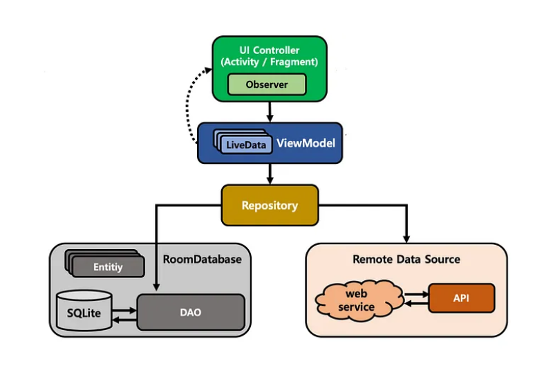

# JogItUp Android App

    

**Author:** [Shivdatt Jangam](https://www.linkedin.com/in/shivdatt-jangam-96b814254/)

# Features

- **Foreground Service**: Implements a foreground service to track jogging sessions in the background, ensuring uninterrupted operation.
- **Google Maps Integration**: Integrates Google Maps Services for real-time location tracking and visualization of jogging routes.
- **Dependency Injection with Dagger Hilt**: Utilizes Dagger Hilt for dependency injection, improving code and streamlines the process of injecting dependencies.
- **MVVM Architecture**: Implements the Model-View-ViewModel architectural pattern for better separation of concerns.
- **Room Persistence Library**: Utilizes Room for local database storage, enabling efficient data management.
- **Kotlin Coroutines**: Harnesses the power of Kotlin Coroutines for asynchronous and non-blocking programming, ensuring smooth user experience.

# Model 

    

# Contributors

- **Shivdatt Jangam**: [GitHub](https://github.com/shivdatt1999)
- **Special Thanks**: [Philip Lackner](https://www.youtube.com/@PhilippLackner) 

